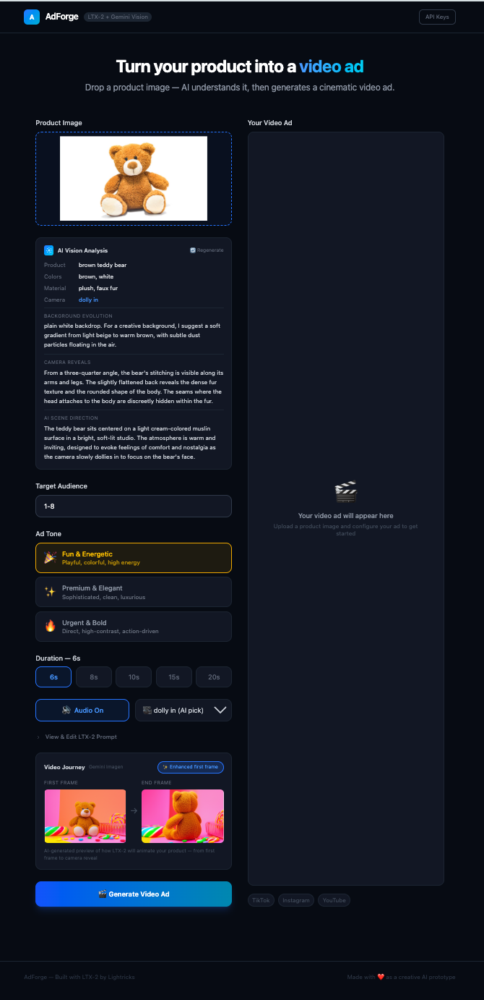

# AdForge

Turn product photos into cinematic video ads using a multi-model AI pipeline.

**Live demo:** [adforge-three.vercel.app](https://adforge-three.vercel.app)



## How It Works

AdForge chains three AI models together to go from a single product photo to a polished video ad:

1. **Gemini Vision** (gemini-2.0-flash) — Analyzes the product photo to extract product details, colors, materials, shape, and suggests creative camera angles and scene direction.

2. **Gemini Imagen** (gemini-2.0-flash-exp-image-generation) — Generates an enhanced first frame (product in a professional setting) and an alternate-angle end frame, both styled to match the selected ad tone.

3. **LTX-2 Video** (ltx-2-pro / ltx-2-fast) — Generates a cinematic video ad from the enhanced first frame, with camera motion that reveals the product from multiple angles.

## Features

- **AI-powered product analysis** — Automatic detection of product type, colors, materials, and optimal camera angles
- **Enhanced first frame** — AI-generated professional product photography background, adapted to ad tone
- **Alternate angle end frame** — AI-generated view of the product from a different perspective, style-matched to the first frame
- **Three ad tones** — Fun & Energetic, Premium & Elegant, Urgent & Bold — each affects image backgrounds, lighting, and video atmosphere
- **Target audience integration** — Audience description influences all generated content
- **Editable prompts** — Full control over the LTX-2 video prompt
- **Duration control** — 6s to 20s (auto-switches to LTX-2 Fast for durations over 10s)
- **Camera motion selection** — Dolly, jib, static, focus shift — AI suggests the best one
- **Audio generation** — Optional AI-generated audio for the video
- **Video Journey preview** — Side-by-side first frame and end frame before generating

## Tech Stack

- React 19 + TypeScript 5.9
- Vite 7
- TailwindCSS 4
- Gemini API (Vision + Image Generation)
- LTX Video API by Lightricks

## Try It

Visit the [live demo](https://adforge-three.vercel.app) — API keys are pre-configured, just upload a product image and go.

## Run Locally

```bash
npm install
npm run dev
```

Open [localhost:5173](http://localhost:5173). API keys are included for demo purposes. To use your own, click "API Keys" in the header.

## Architecture

```
Product Photo
    |
    v
Gemini Vision (analysis)
    |
    +--> Gemini Imagen (enhanced first frame, tone-aware)
    |        |
    |        +--> Gemini Imagen (alt angle end frame, style-matched)
    |
    +--> Build LTX-2 prompt (tone + audience + analysis)
    |
    v
LTX-2 Video API (image-to-video)
    |
    v
MP4 Video Ad
```

## Deployment

Deployed on Vercel with API rewrites configured in `vercel.json` to proxy `/api/*` requests to the LTX Video API.

```bash
npm run build
vercel --prod
```
